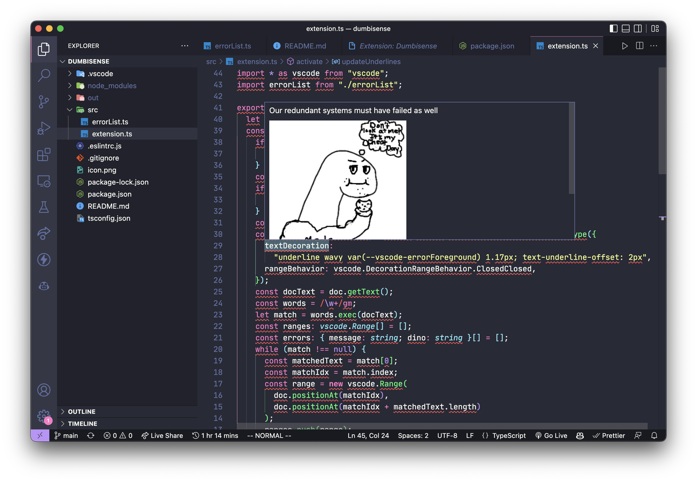

# Dumbisense

Dumbisense is a VS Code extension that adds a red error squiggle to every word in your code, with an interesting error message and dino image.

To install, go to https://marketplace.visualstudio.com/items?itemName=mliu.dumbisense or search for `dumbisense` in VS Code's Extensions tab.

Errors are from https://gist.github.com/fortytw2/78f5f9ef915cb43a3be4.  
Dino images are from the https://geta.dino.icu api, which pulls from https://github.com/hackclub/dinosaurs.

<small>

Built with 🧋 by [maggie](https://maggieliu.dev) for [Assemble](https://assemble.hackclub.com).

</small>
