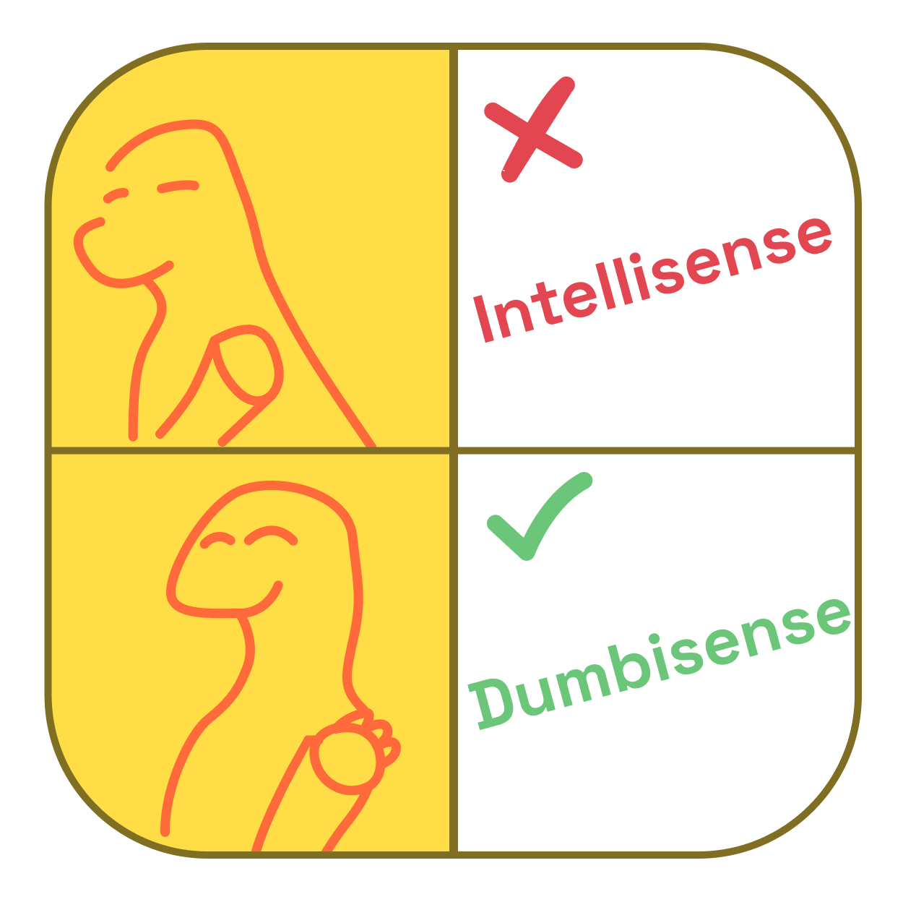

# dumbisense

Adds a red error squiggle to every word in your code, with an interesting error message and dino image.

Errors are from https://gist.github.com/fortytw2/78f5f9ef915cb43a3be4.  
Dino images are from the https://geta.dino.icu api, which pulls from https://github.com/hackclub/dinosaurs.
